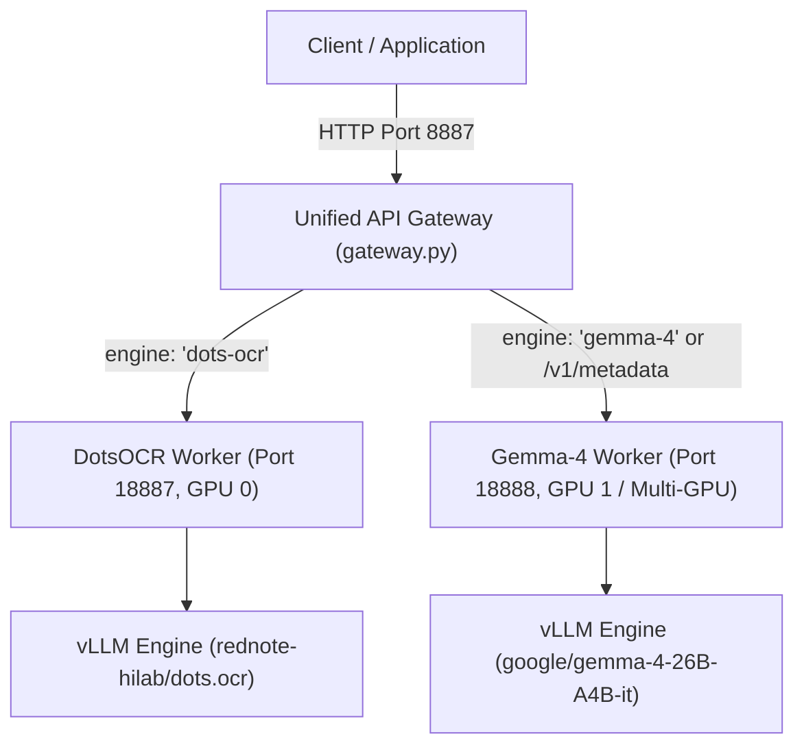

# Kalanjiyam DotsOCR & Archival Metadata Extraction Service

A high-performance, multi-engine FastAPI service and distributed inference pipeline providing layout-aware OCR (DotsOCR / Gemma-4) and Archival Metadata Extraction with dynamic GPU allocation, concurrency gating, and automated Tensor Parallelism.

---

## 🏛️ System Architecture



- **Unified Gateway (Port 8887)**: Single public entrypoint that inspects incoming requests and routes them to dedicated GPU worker containers.
- **DotsOCR Worker (Port 18887)**: Dedicated worker optimized for high-speed page layout parsing and bbox extraction.
- **Gemma-4 Worker (Port 18888)**: Dedicated worker handling multimodal OCR and Archival Metadata Extraction with smart GPU memory management.
- **Async Batch Pipeline**: High-throughput distributed batch streaming from S3/local storage through vLLM/SGLang backends.

---

## 🚀 API Endpoints

### 1. Layout-Aware OCR (`POST /v1/ocr`)
Extracts text and typed layout blocks (headings, paragraphs, tables, equations, footers) with normalized pixel bounding boxes.

```bash
# DotsOCR (Default)
curl -X POST http://localhost:8887/v1/ocr \
  -F "file=@sample.jpg"

# Gemma-4 OCR
curl -X POST http://localhost:8887/v1/ocr \
  -F "file=@sample.jpg" \
  -F "engine=gemma-4"
```

### 2. Archival Metadata Extraction (`POST /v1/metadata`)
Stateless per-window metadata extraction returning structured archival description fields (titles, dates, entities, scope content) alongside per-window metrics (`chars_in`, `engine_latency_ms`, `usage`, `fields_attempted`, `fields_returned`, `fields_declined`).

```bash
curl -X POST http://localhost:8887/v1/metadata \
  -H "Content-Type: application/json" \
  -d '{
    "unit_id": "unit_001",
    "pages": [
      {
        "page_idx": 0,
        "blocks": [
          {"block_idx": 0, "type": "title", "text": "GOVERNMENT OF TAMIL NADU ARCHIVES"},
          {"block_idx": 1, "type": "paragraph", "text": "Public Department Order No. 452 dated 14th August 1942 regarding administrative reforms..."}
        ]
      }
    ]
  }'
```

### 3. Discovery & Health
- **Engine Discovery (`GET /v1/engines`)**: Returns active worker statuses and assigned GPU indices.
- **Health Check (`GET /health`)**: Deep health probe for worker responsiveness and GPU status.
- **GPU Telemetry (`GET /gpu-status`)**: Real-time VRAM allocation and free memory per GPU.

---

## ⚡ Hardware & GPU Configuration Flags

The service dynamically detects available GPU memory and hardware capabilities:
- **NVIDIA H100 / A100 (80GB VRAM)**: Unquantized Gemma-4-26B runs comfortably on a **single GPU (`TP=1`)** with full CUDA Graph optimizations.
- **NVIDIA RTX A6000 / A100 (40GB/48GB VRAM)**: Automatically switches to **Tensor Parallelism (`TP=2`)** across 2 GPUs so the 26B model loads with >24GB of free KV-cache headroom.

### Configuration Reference

| Parameter | Environment Variable | CLI Flag (`server_app.py`) | Recommended on H100 (80GB) | Recommended on A6000 (48GB) |
| :--- | :--- | :--- | :--- | :--- |
| **Tensor Parallelism** | `TENSOR_PARALLEL_SIZE` | `--tp-size` | `1` (Single GPU) | `2` (Dual GPU) or `1` (if quantized) |
| **Context Sequence Length** | `VLLM_MAX_MODEL_LEN` | `--max-model-len` | `8192` or `16384` | `4096` or `8192` |
| **CUDA Graphs / Eager** | `VLLM_ENFORCE_EAGER` | `--enforce-eager` | `0` (CUDA Graph acceleration) | `0` (with TP=2) or `1` |
| **Quantization** | `VLLM_QUANTIZATION` | `--quantization` | *(None / bfloat16)* | *(None / `fp8` / `bitsandbytes`)* |
| **KV Cache Dtype** | `VLLM_KV_CACHE_DTYPE` | `--kv-cache-dtype` | `auto` or `fp8` | `auto` or `fp8` |
| **GPU Memory Utilization** | `GPU_MEMORY_UTILIZATION` | `--gpu-memory-utilization` | `0.90` | `0.90` – `0.95` |
| **Pinned GPU ID** | `PINNED_GPU_ID` | `--pinned-gpu` | *(Empty for auto)* | *(Empty for auto)* |
| **Worker Concurrency** | `API_MAX_CONCURRENT_REQUESTS` | — | `16` | `8` |

---

### GPU-Specific Launch Presets

#### 1. NVIDIA RTX A6000 / RTX 6000 Ada / A100 (48GB VRAM)
```bash
# Option A (Recommended): Google Gemma-4 E4B (Full Precision BF16 in ~8GB VRAM, blazing fast)
GEMMA4_MODEL_PATH=google/gemma-4-E4B-it bash run_docker.sh start

# Option B: Google Gemma-4 26B with BitsAndBytes Quantization (~18-22GB VRAM on 1 GPU)
VLLM_QUANTIZATION=bitsandbytes bash run_docker.sh start

# Option C: Google Gemma-4 26B with FP8 Quantization (~18GB VRAM on 1 GPU)
VLLM_QUANTIZATION=fp8 bash run_docker.sh start
```

#### 2. NVIDIA H100 (80GB VRAM) & A100 (80GB VRAM)
```bash
# Full Precision Gemma-4 26B with CUDA Graph Acceleration and 16k context window
TENSOR_PARALLEL_SIZE=1 VLLM_ENFORCE_EAGER=0 VLLM_MAX_MODEL_LEN=16384 bash run_docker.sh start

# Pinned dedicated H100 GPUs (DotsOCR on GPU 0, Gemma on GPU 1)
DOTSOCR_GPU_ID=0 GEMMA_GPU_ID=1 TENSOR_PARALLEL_SIZE=1 bash run_docker.sh start
```

#### 3. NVIDIA RTX 4090 / RTX 3090 / A100 (24GB – 40GB VRAM)
```bash
# Gemma-4 E4B (High accuracy multimodal in ~8GB VRAM)
GEMMA4_MODEL_PATH=google/gemma-4-E4B-it bash run_docker.sh start

# Gemma-4 E2B (Ultra lightweight in ~4GB VRAM)
GEMMA4_MODEL_PATH=google/gemma-4-E2B-it bash run_docker.sh start

# Gemma-4 26B with 4-bit BitsAndBytes quantization
VLLM_QUANTIZATION=bitsandbytes GEMMA4_MAX_MODEL_LEN=4096 bash run_docker.sh start
```

---

## 🐳 Docker Deployment (`run_docker.sh`)

The easiest way to start and manage the services is using [`run_docker.sh`](file:///home/mrportable/Documents/kalanjiyam-dots-ocr/run_docker.sh):

```bash
# Build and start Gateway + DotsOCR Worker (GPU 0) + Gemma Worker (GPU 1+)
bash run_docker.sh start

# Check service and GPU statuses
bash run_docker.sh status

# Tail logs across all containers
bash run_docker.sh logs

# Cleanly stop all containers
bash run_docker.sh stop

# Rebuild images without Docker cache
bash run_docker.sh rebuild
```

### Customizing Deployments via Environment Variables

You can prepend environment variables directly to `bash run_docker.sh start`:

```bash
# Example 1: Fast Gemma-4 E4B Model on any GPU
GEMMA4_MODEL_PATH=google/gemma-4-E4B-it bash run_docker.sh start

# Example 2: Unquantized 26B Model on H100 80GB
TENSOR_PARALLEL_SIZE=1 VLLM_MAX_MODEL_LEN=16384 bash run_docker.sh start

# Example 3: Quantized 26B Model on Single A6000 48GB
VLLM_QUANTIZATION=bitsandbytes bash run_docker.sh start
```

---

## 💻 Standalone Execution

Run `server_app.py` directly without Docker:

```bash
# Start DotsOCR on GPU 0
python server_app.py --port 18887 --engine dots-ocr --pinned-gpu 0

# Start Gemma-4 on GPU 1 with TP=2 across 2 GPUs
python server_app.py --port 18888 --engine gemma-4 --tp-size 2 --max-model-len 8192

# Start Unified Gateway
python gateway.py
```

---

## 📦 Async Batch Inference Pipeline (`async_infer-lazy-buffer_newer_w_s3.py`)

For high-throughput offline batch processing across thousands of document pages and PDFs:

```bash
python async_infer-lazy-buffer_newer_w_s3.py \
  --input-path s3://my-bucket/pdfs/ \
  --output-file /data/ocr_results.jsonl \
  --instruction-path instruction_prompts.yml \
  --task dotsocr_w_layout \
  --backend vllm-chat \
  --model /root/.cache/weights/DotsOCR \
  --max-concurrency 100 \
  --buffer-size 100 \
  --temp-path /opt/dlami/nvme/myuser \
  --spill-path /opt/dlami/nvme/myuser/spill.jsonl \
  --host 127.0.0.1 \
  --port 8887
```

### Batch Arguments Reference

| Argument | Required | Default | Description |
| :--- | :--- | :--- | :--- |
| `--input-path` | ✅ | — | Path to images/PDFs directory or `s3://` URI |
| `--output-file` | ✅ | — | Output JSONL file path |
| `--instruction-path` | ✅ | — | YAML file containing task/prompt templates |
| `--task` | ✅ | — | Dot-separated key in YAML template (e.g. `dotsocr_w_layout`) |
| `--temp-path` | ✅ | — | NVMe scratch directory for S3 PDF streaming |
| `--backend` | ❌ | `sglang` | `vllm`, `vllm-chat`, `sglang`, `lmdeploy`, `trt` |
| `--max-concurrency` | ❌ | `100` | Max concurrent in-flight requests |
| `--buffer-size` | ❌ | `50` | Prefetch queue size |
| `--pdf-dpi` | ❌ | `200` | Rendering resolution for PDF conversion |

---

## 📄 License & Contracts

- **OCR Service Contract**: Kalanjiyam OCR Service Contract (v2.1)
- **Metadata Extraction Contract**: Metadata Extraction API Specification (v1.0)
- **Base Models**: DotsOCR (`rednote-hilab/dots.ocr`), Google Gemma 4 (`google/gemma-4-26B-A4B-it`)
